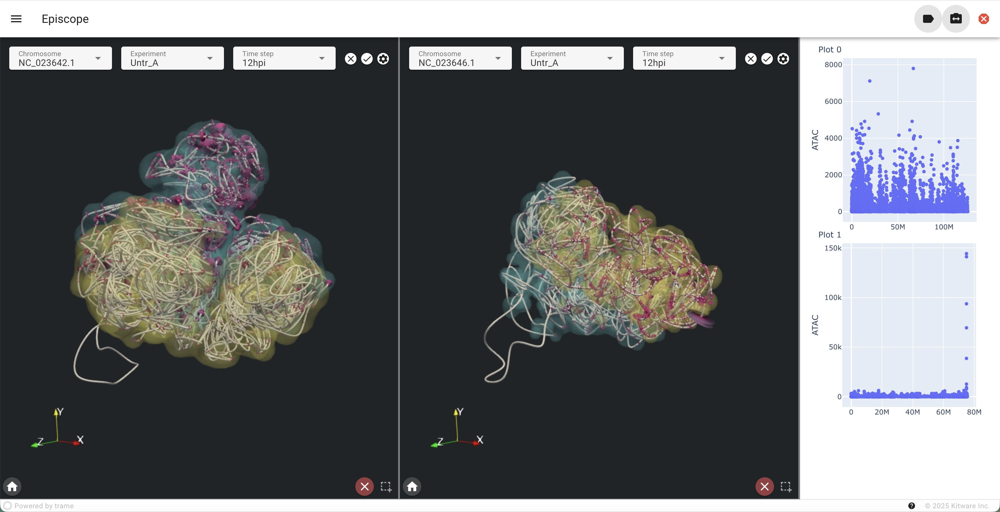
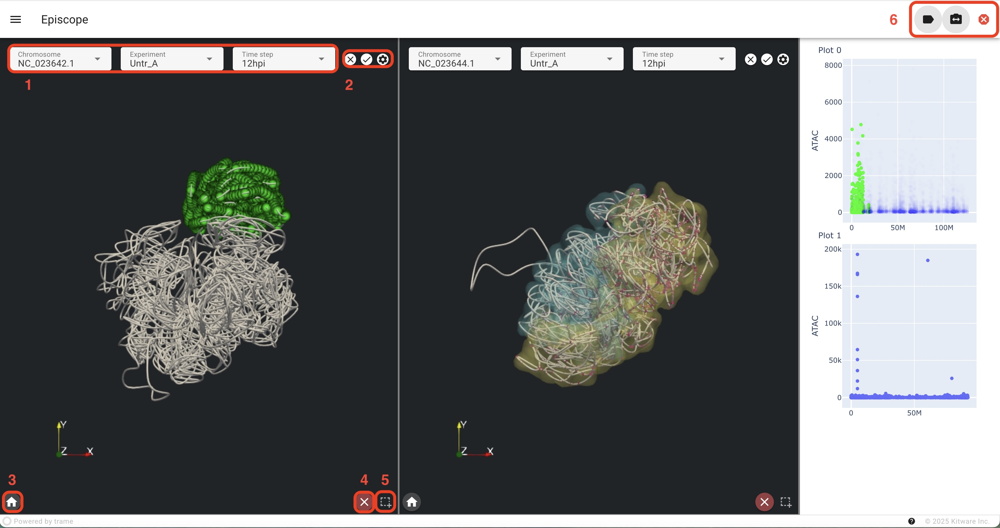
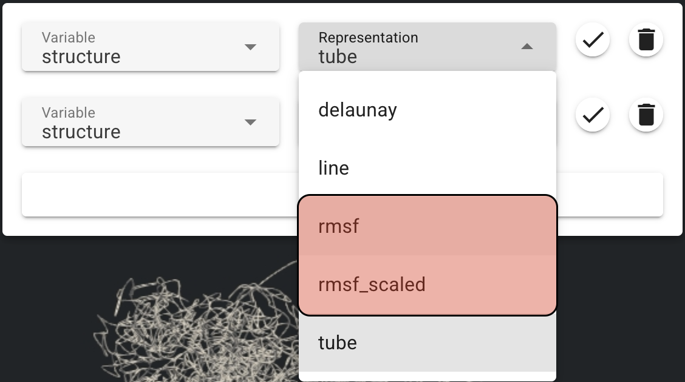
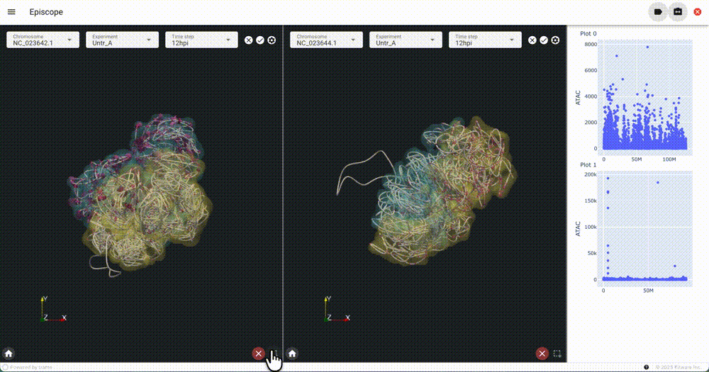

# episcope

A tool for exploration of epigenetic datasets

||
| ---- |
|*Screen capture of the episcope tool, showing visualizations of four chromosomes from an experiment.*|


## Prerequisites

- A recent (5.13+) version of ParaView

## Installing

Create a python virtual environment with a Python version matching the
`pvpython` version:
- Paraview `5.13` ships with Python `3.10`.
- Paraview `6.0` ships with Python `3.12`.

We will install the app and its dependencies in this virtual environment.

```bash
# Create the virtual environment (check the appropriate python version, see above)
python3 -m venv .venv --python=3.10

# Activate it
source .venv/bin/activate

# Install the app from PyPI
pip install episcope

# Deactivate the virtual environment
deactivate
```

Or install from a clone of this repository.

```bash
# Create the virtual environment (check the appropriate python version, see above)
python3 -m venv .venv --python=3.10

# Activate it
source .venv/bin/activate

# Clone the repository
git clone https://github.com/epicsuite/episcope.git

# Install the app from PyPI
pip install ./episcope

# Deactivate the virtual environment
deactivate
```

## Running

Finally, start the application using the `pvpython` already present on your
machine

```bash
pvpython --venv .venv -m episcope.app --data /path/to/dataset
```

## Development

Clone this repository and `cd` into it:

```bash
git clone git@github.com:epicsuite/episcope.git

# or if without ssh:
# git clone https://github.com/epicsuite/episcope.git

cd episcope
```

Follow the same instructions as above, with the exception that the `episcope` package should be installed from local source:
```bash
# Install the app in editable mode
pip install -e .
```

## Command line arguments
List of optional command line arguments.

### `--num-quadrants | -n`
Specify the number of 3D/2D quadrants in the app layout

### `--display-options | -o`

Path to a file will be used to override the default appearance of the 3D visualization.

Example of a minimal display options file:
```
tube:
  Opacity: 0.5

delaunay:
  Opacity: 0.1

upper_gaussian_contour:
  Opacity: 0.8

lower_gaussian_contour:
  Opacity: 0.8

labels:
  color: [0, 1, 0]

spheres:
  color: [1, 0, 1]
```

## GUI Controls

||
| ---- |
|*Overview of GUI controls*|

1. Dataset selection (Chromosome, Experiment, Timestep)
2. Clear Chromosome, Apply Chromosome, Chromosome Representations
3. Reset Camera
4. Clear Selection
5. Enable/Disable Renderview Selection
6. Enable/Disable Labels, Enable/Disable linked camera between views, Terminate server

## RMSF Coloring
If the structure.csv column has a rmsf column, the structure can be colored to show chromatin mobility (`rmsf`) with an option to also scale the tube size by rmsf (`rmsf_scaled`).

||
| ---- |
|*Example RMSF coloring video*|

## Synced Selection for Narrow Peak Data
If the data has a narrow peak variable, you can do a synced selection between the 3D object in the renderview and the 2D plot. *IMPORTANT: structure -> line must be enabled in the representations for the selection to work*.

||
| ---- |
|*Example synced selection video*|
